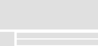

# SkeletonLayout

[](https://mvnrepository.com/artifact/com.faltenreich/skeletonlayout)

*Make your app feel faster*


Users are time-sensitive and may skip an app due to long loading times and missing visual feedback. 
Instagram, Facebook, Google and other services tackled this problem with the so-called Skeleton View.
This view is being displayed during the process of fetching or requesting data asynchronously which leads to a perceivedly
more responsive app.

This library implements the Skeleton View pattern and provides an easy way for other developers to enable it in their apps. 

## Demo

<a href='https://play.google.com/store/apps/details?id=com.faltenreich.skeletonlayout&pcampaignid=MKT-Other-global-all-co-prtnr-py-PartBadge-Mar2515-1'></a>

## Preview


The SkeletonLayout mimics the design of established implementations per default, but you are free to get creative. 
Create your own skeleton view with custom shapes, colors and shimmers.

&nbsp;
&nbsp;


## Features

- **Make your app feel faster:** Immediate visual feedback long before your data has been fetched or requested
- **Support any View:** Apply to any type of View or ViewGroup
- **RecyclerView on speed:** Convenience adapter for RecyclerView as it is the main use case
- **ViewPager2 support:** Convenience adapter for ViewPager2 as it uses a RecyclerView under the hood
- **Customization:** Adjust shimmer, color and shape of the skeleton to set you apart from other apps
- **Minimum effort:** A fistful lines of code to use the SkeletonLayout
- **Minimum footprint:** org.jetbrains.kotlin:kotlin-stdlib-jdk7, androidx.recyclerview:recyclerview and androidx.viewpager2.widget.ViewPager2 are the only dependencies

### Getting Started

##### Gradle
```gradle
buildscript {
    repositories {
        mavenCentral()
    }
}
```
```gradle
dependencies {
    implementation 'com.faltenreich:skeletonlayout:<version>'
}
```

##### XML
```xml
<com.faltenreich.skeletonlayout.SkeletonLayout
    android:id="@+id/skeletonLayout"
    android:layout_width="match_parent"
    android:layout_height="wrap_content">
    
    <!-- Views to mask -->
    
</com.faltenreich.skeletonlayout.SkeletonLayout>
```

##### Kotlin
```kotlin
class MainActivity : AppCompatActivity() {

    private lateinit var skeleton: Skeleton

    override fun onCreate(savedInstanceState: Bundle?) {
        super.onCreate(savedInstanceState)
        setContentView(R.layout.activity_main)

        // Either use an existing Skeletonlayout
        skeleton = findViewById(R.id.skeletonLayout)

        // or create a new SkeletonLayout from a given View
        skeleton = view.createSkeleton()

        // and customize every detail including the layout used for the skeleton mask
        skeleton = view.createSkeleton(config = SkeletonConfig.default(this, maskLayout = R.layout.custom_mask))
        
        // support ViewPager2
        skeleton = viewPager2.applySkeleton(R.layout.list_item_viewpager2)

        // support RecyclerView
        skeleton = recyclerView.applySkeleton(R.layout.list_item_recyclerview)
        
        skeleton.showSkeleton()
    }

    // Example callback that hides skeleton
    private fun onDataLoaded() {
        skeleton.showOriginal()
    }
}
```

##### Java
```java
public class MainActivity extends AppCompatActivity {
    
    private Skeleton skeleton;
    
    @Override
    public void onCreate(@Nullable Bundle savedInstanceState) {
        super.onCreate(savedInstanceState);
        setContentView(R.layout.activity_main);
        
        // Either use an existing SkeletonLayout
        skeleton = findViewById(R.id.skeletonLayout);
        
        // or create a new SkeletonLayout from a given View
        skeleton = SkeletonLayoutUtils.createSkeleton(view);

        // and customize every detail including the layout used for the skeleton mask
        skeleton = SkeletonLayoutUtils.createSkeleton(view, SkeletonConfig.Companion.defaults(this, R.layout.custom_mask));

        // support ViewPager2
        skeleton = SkeletonLayoutUtils.applySkeleton(viewPager2, R.layout.list_item_viewpager2);

        // support RecyclerView
        skeleton = SkeletonLayoutUtils.applySkeleton(recyclerView, R.layout.list_item_recyclerview);

        skeleton.showSkeleton();
    }
    
    // Example callback that hides skeleton
    private void onDataLoaded() {
        skeleton.showOriginal();
    }
}
```

### Configuration

| Property                | Type      | Description                                                                                                               |
|-------------------------|-----------|---------------------------------------------------------------------------------------------------------------------------|
| maskLayout              | reference | Optional reference to layout resource that should be masked when skeleton is applied (defaults to wrapped view if null)   |
| maskColor               | color     | Color of the mask that fills the original view bounds (defaults to #E0E0E0)                                               |
| maskCornerRadius        | dimension | The x- and y-radius of the oval used to round the mask corners (defaults to 25)                                           |
| showShimmer             | boolean   | Animate shimmer if set to true (defaults to true)                                                                         |
| shimmerColor            | color     | Color of the animated shimmer (defaults to #d5d5d5)                                                                       |
| shimmerDurationInMillis | integer   | Duration in milliseconds for one shimmer animation interval (defaults to 2000)                                            |
| shimmerDirection        | enum      | Direction of animated shimmer (defaults to LEFT_TO_RIGHT)                                                                 |
| shimmerAngle            | integer   | Angle in degrees for animated shimmer (defaults to 0)                                                                     |
| itemCount               | integer   | Item count for Skeleton adapter (RecyclerView and ViewPager2 only, defaults to 3)                                         |

### FAQ

**When and how is the skeleton created?**
The skeleton gets created after the original view's onLayout(), since we rely on it to be fully rendered in order to mask its bounds.

**How does the masking work?**
The mask is drawn onto a single Bitmap by iterating once through the given Views and their bounds.

**May properties of the SkeletonLayout be changed at runtime?**
Yes. Any change to the skeleton leads to a redraw, since the whole content of the SkeletonLayout gets drawn onto a single bitmap.

**Will the shimmer eat my users' battery?**
The shimmer is a shader (LinearGradient) whose local matrix is updated according to the frame rate of the target device, 
so no redrawing is required and processing time is kept to an absolute minimum. 
Additionally the shimmer gets inactive onWindowFocusChanged() and onDetachedFromWindow().

### Third-party licenses

This software uses following technologies with great appreciation:

* [AndroidX](https://developer.android.com/jetpack/androidx)
* [ColorSlider](https://github.com/naz013/ColorSlider)
* [gradle-maven-publish-plugin](https://github.com/vanniktech/gradle-maven-publish-plugin)
* [Material Components for Android](https://material.io/components)

### License

Copyright 2025 Philipp Fahlteich

Licensed under the Apache License, Version 2.0 (the "License");
you may not use this file except in compliance with the License.
You may obtain a copy of the License at

    http://www.apache.org/licenses/LICENSE-2.0

Unless required by applicable law or agreed to in writing, software
distributed under the License is distributed on an "AS IS" BASIS,
WITHOUT WARRANTIES OR CONDITIONS OF ANY KIND, either express or implied.
See the License for the specific language governing permissions and
limitations under the License.

 