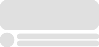

# SkeletonLayout  

[  ](https://bintray.com/faltenreich/maven/SkeletonLayout/_latestVersion) 
[](https://android-arsenal.com/api?level=14)

*Make your app feel faster*


Users are time-sensitive and may skip an app due to long loading times and missing visual feedback. 
Instagram, Facebook, Google and other services tackled this problem with the so-called Skeleton View.
This view is being displayed during the process of fetching or requesting data asynchronously which leads to a perceivedly
more responsive app.

This library implements the Skeleton View pattern and provides an easy way for other developers to support it in their apps. 

## Preview


The SkeletonLayout mimics the design of established implementations per default, but you are free to get creative. 
Create your own skeleton view with custom shapes, colors and shimmers.

      

## Features

- **Make your app feel faster:** Immediate visual feedback long before your data has been fetched or requested
- **Support any View:** Apply to any type of View or ViewGroup
- **RecyclerView on speed:** Convenience adapter for the RecyclerView, since it is the main use case
- **Customization:** Adjust shimmer, color and shape of the skeleton to set you apart from other apps
- **Minimum effort:** A fistful lines of codes to use the SkeletonLayout
- **Minimum footprint:** org.jetbrains.kotlin:kotlin-stdlib-jre7 and com.android.support:design as the only dependencies

### Getting Started

##### Gradle
```gradle
dependencies {
    implementation 'com.faltenreich:skeletonlayout:1.0.0'
}
```

##### XML
```xml
<com.faltenreich.skeletonlayout.SkeletonLayout
    android:id="@+id/skeletonLayout"
    android:layout_width="match_parent"
    android:layout_height="wrap_content">
    
    <!-- Views to mask -->
    
</com.faltenreich.skeletonlayout.SkeletonLayout>
```

##### Java
```java
public class MainActivity extends AppCompatActivity {
    
    private SkeletonLayout skeletonLayout;
    private Skeleton recyclerViewSkeleton;
    
    @Override
    public void onCreate(@Nullable Bundle savedInstanceState) {
        super.onCreate(savedInstanceState);
        setContentView(R.layout.activity_main);
        
        skeletonLayout = findViewById(R.id.skeletonLayout);
        skeletonLayout.showSkeleton();
        
        recyclerViewSkeleton = SkeletonLayoutUtils.applySkeletonAdapter(findViewById(R.id.recyclerView), R.layout.list_item);
    }
    
    // Example for returning back to original views after a certain event
    private fun onDataLoaded() {
        skeletonLayout.hideSkeleton();
        recyclerViewSkeleton.hideSkeleton();
    }
}
```

##### Kotlin
```kotlin
class MainActivity : AppCompatActivity() {

    private lateinit var skeletonLayout: SkeletonLayout
    private lateinit var recyclerViewSkeleton: Skeleton
    
    override fun onCreate(savedInstanceState: Bundle?) {
        super.onCreate(savedInstanceState)
        setContentView(R.layout.activity_main)
        
        val skeletonLayout = findViewById(R.id.skeletonLayout)
        skeletonLayout.showSkeleton()
        
        // We are using an extension function here
        recyclerViewSkeleton = findViewById(R.id.recyclerView).applySkeletonAdapter(R.layout.list_item)
    }
    
    // Example for returning back to original views after a certain event
    private fun onDataLoaded() {
        skeletonLayout.hideSkeleton()
        recyclerViewSkeleton.hideSkeleton()
    }
}
```

### Configuration

Property | Type | Description
--- | --- | ---
maskColor | color | Color of the mask that fills the original view bounds (defaults to #E0E0E0)
maskCornerRadius | dimension | The x- and y-radius of the oval used to round the mask corners (defaults to 25)
showShimmer | boolean | Animate left-to-right shimmer, if set to true (defaults to true)
shimmerColor | color | Color of the animated shimmer (defaults to #d5d5d5)
shimmerDurationInMillis | integer | Duration in milliseconds for one shimmer animation interval (defaults to 2000)

### FAQ

**When and how is the skeleton created?**
The skeleton gets created after the original view's onLayout(), since we rely on it to be fully rendered in order to mask its bounds.

**How does the SkeletonLayout work?**


**May properties of the SkeletonLayout be changed on runtime?**
Yes. Any change to the skeleton leads to a redraw, since the whole content of the SkeletonLayout gets drawn onto a single bitmap.

**How does the shimmer work?**
The shimmer is a lightweight bitmap that is animated according to the framerate of the target device.

**What about performance?**
<TODO>

### License

Copyright 2018 Philipp Fahlteich

Licensed under the Apache License, Version 2.0 (the "License");
you may not use this file except in compliance with the License.
You may obtain a copy of the License at

    http://www.apache.org/licenses/LICENSE-2.0

Unless required by applicable law or agreed to in writing, software
distributed under the License is distributed on an "AS IS" BASIS,
WITHOUT WARRANTIES OR CONDITIONS OF ANY KIND, either express or implied.
See the License for the specific language governing permissions and
limitations under the License.